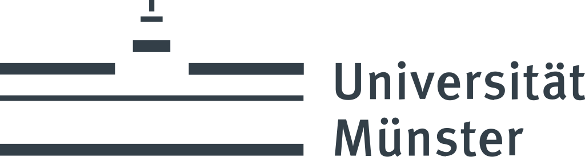
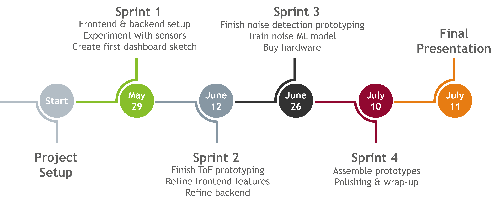

# TinyAIoT

  
  

Welcome to the documentation of our TinyAIoT project. The TinyAIoT project is an innovative initiative, developed during a project seminar as part of the Information Systems and Geoinformatics Master's programs at the University of Münster. In collaboration with the cities of Emsdetten and Laer, we aimed to advance smart city technologies through sensor development.

The project is concerned with the development of sensors to advance cities in the smart city sector. On the one hand, a sensor was developed that measures the fill level of public garbage cans, and on the other, a sensor that records and analyzes the volume in an area. This data is collected and displayed in a dashboard, which the cities can then use to send optimized routes for emptying the garbage cans to their specialists, or to track the development of noise levels and, if necessary, develop measures to take action against violations.

# Content
1. [Project management](#Project-Management)
     - [Objectives and Requirements](#Objectives-and-Requirements)
     - [Roles and Responsibilities](#Roles-and-Responsibilities)
     - [Schedule](#Schedule)
     - [Communication and Meetings](#Communication-and-Meetings)
     - [Reflection and Future Outlook](Reflection-and-Future-Outlook).
2. [Sensors](https://github.com/tinyaiot-ps/sensor/blob/main/README.md)
3. [Backend](https://github.com/tinyaiot-ps/backend/blob/main/README.md)
4. [Frontend](https://github.com/tinyaiot-ps/frontend/blob/main/README.md)

---

## Project Management
This section describes various aspects related to project management. It aims to provide a comprehensive overview of the entire project and assist those who wish to integrate the project into their own systems. By understanding our structure and methodologies, readers can adopt successful processes and avoid the pitfalls we encountered.

### Objectives and Requirements

At the start of the project, there was already the idea of equipping waste garbage cans with fill level sensors in order to show these fill levels on a dashboard and thus give cities the opportunity to create dedicated routes for full waste garbage cans so that not all waste garbage cans always have to be collected. The supervisors presented an illustration for this, which served as a leitmotif until the end of the project:

  

 Initial discussions with the cities revealed that, in addition to smart trashcans, there was also great interest in a sensor system that measures the noise level at certain times of the day in order to better identify problems such as disturbance of the peace. As a result, in addition to our main project of smart trashcans, we also defined a side project for noise detection, so we differentiated between these projects.

### Identified Problems
Both internally and in the various meetings with the cities, we identified the core problems that set the framework for the overall project:

| Smart Trashcans | Noise Detection |
|:---:|:---:|
|Most Trashcans are not attached to a sensor|Citizens like to use public spaces at night|
|Waste management employees have their fixed routes|Residents at public spaces want to rest|
|Cities do not have an overview on fill levels|Cities have limited law enforcement personnel|
|→ Waste retrieval processes are inefficient|→ Citizens and residents are in conflict|

### Project Objectives
To address the challenges identified in the initial phase of the project, we established the following objectives:

| Smart Trashcans | Noise Detection |
|:---:|:---:|
| Create a TinyAIoT prototype for trashcans to measure their fill level| Create a TinyAIoT prototype for noise detection to measure decibel and the likeliness of noise|
| Create a dashboard based on the cities' requirements to display trashcan fill level and offer routing options| Create a machine learning model to identify the source of noise|
| Configure and deploy trashcan sensors and display them in the dashboard| Create a dashboard tab to display noise measurements|

According to the objectives of our project, we divided our team into different groups for the further course of the project.

---

### Roles and Responsibilities
The success of the TinyAIoT project was largely due to the effective collaboration and clear distribution of roles among the team members. The team, consisting of nine Information Systems Master's students, was strategically divided into three main groups, each with specific responsibilities essential to the project's goals. In order to gain further expertise in different subject areas, the students wrote seminar papers on the various topics before the start of the project in order to act as experts in a specific area. While each group focused on their primary tasks, cross-functional support was encouraged to ensure seamless project integration.

#### Sensors:
The Sensors team consisted of Anni, Michael, Shadia, and Philipp. This team dealt with the development and assembly of the prototypes for the two sensors. This included dealing with the individual components and deciding which of the components would ultimately be used. The installation of the corresponding software and, for the noise detection project, the creation of a machine learning program to identify the source of the noise were also part of the work. The process and further information on this can be found in chapter 2  [Sensors](https://github.com/tinyaiot-ps/sensor/blob/main/README.md).

#### Backend:
The backend team consisted of Nils and Ahsan. This team designed the corresponding structure and the databases that provided the dashboard with the required information on fill levels and noise levels. Login processes and settings were also processed by this team. A more detailed explanation and the corresponding code can be found in chapter 3 [Backend](https://github.com/tinyaiot-ps/backend/blob/main/README.md).

#### Frontend:
The frontend team consisted of Sven and Kashif. This team was responsible for creating the dashboard mockups that were used during the communication with the cities to show actual and target states. The team also worked on implementing these mockups and designing the final dashboard. You can find more information and the corresponding code in chapter 4 [Frontend](https://github.com/tinyaiot-ps/frontend/blob/main/README.md).

In addition to the three main groups, the project management area, led by Robin, also played a crucial role in ensuring the project stayed on track. Robin was responsible for coordinating communication between the cities and supervisors, organizing meetings, and preparing materials that were essential for the decision-making process.

---

### Schedule

A distinguishing feature of this project was its unusually short timeframe for an IT-project. Work commenced in early May 2024 and wrapped up with the final presentation on July 11, 2024. Given the tight schedule, a well-defined structure and robust communication were essential. To manage the project effectively, we established multiple milestones aligned with the agile Scrum methodology. These milestones were achieved through a series of sprints, as shown in the accompanying figure:

  

Although we initially aimed for a complete adoption of Scrum for this project, this approach was adjusted over time. While Scrum offers an excellent structure for full-time projects, it proved to be not entirely feasible in a student context. On the one hand, the students were unable to dedicate their entire working hours to the project, and on the other hand, we relied on timely communication and feedback from external partners, which proved to be challenging.
Therefore, while we adhered to the core agile principles, we adapted the framework to our specific needs. The following figure exemplifies how individual tasks were structured for the successful completion of our sprints. Despite the adaptations, the agile approach helped us to respond flexibly to changing requirements and make progress in short iterations. By regularly reviewing our work, we were able to identify problems early on and find solutions.

  

Communication with external partners proved to be particularly challenging, especially due to unexpectedly long delivery times for components, which significantly exceeded the specified delivery deadlines. These delays made the originally planned delivery and deployment of sensors for data collection impossible. To demonstrate the functionality nevertheless, we relied primarily on simulated data (mock data) for the dashboard. The delivery of the sensors and further work with them will be left to future project teams.

---

### Communication and Meetings

The team has opted for a regular weekly meeting with the supervisors. Here, the successes of the previous week were presented and feedback was received. Obstacles that hindered progress or postponed planned milestones were also addressed here. The supervisors' expertise in the field of sensor technology was particularly valuable for us, allowing us to build on their knowledge and a prototype. Communication with external partners did not take place on a regular basis; meetings were arranged as soon as the project team was able to record new successes or wanted to obtain feedback. A major hurdle in the project was communication with the cities. Although there was a great deal of interest in communication from all parties, it could not always be carried out as desired due to staff absences. Despite some resulting setbacks, we are pleased that the end product was enthusiastically received.

---

### Reflection and Future Outlook

Despite the great overall success of the TinyAIoT project, we have encountered setbacks, particularly in the delivery of the batteries for the level sensors. These delays have prevented us from delivering the sensors as originally planned. However, the interest in continuing this project remains unbroken, both on the part of the University of Münster and the partner cities of Emsdetten and Laer.

For the future, there is great potential and interest in continuing the TinyAIoT project as part of another project seminar. This future initiative could focus on delivering the level sensors and developing further improvements to the dashboard in collaboration with the cities. There is also the possibility of expanding the project by involving more cities, further refining the machine learning model for noise detection and, in particular, evaluating new application areas for the noise sensor.

The overall feedback from the team is extremely positive. Everyone worked together to develop the best possible end product. We would like to thank both the supervisors and the external partners for their commitment, provision of knowledge, resources and data as well as their general assistance with the project.

At the request of various parties, we have decided to make the project public under a Creative Commons Attribution 4.0 International (CC-BY 4.0) license for the documentation part and the MIT license for the code. This decision was made to ensure that the project can be adapted and used by other cities and organizations interested in smart city solutions in the most accessible way possible.

---

&copy; 2024 The TinyAIoT Project Seminar Team at the University of Münster. 
This documentation is licensed under the [Creative Commons Attribution 4.0 International](https://creativecommons.org/licenses/by/4.0/) license unless explicitly noted otherwise.

